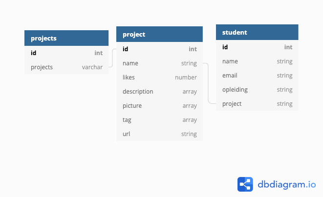

# KASK Virtual Graduation

<p align="center">
  
</p>

[🔗 Go Explore the project ](https://relaxed-babbage-d98010.netlify.app/)

## Table-of-contents 
- [👨 The Costumer](#The-Costumer)
- [🔎 What is it?](#What-is-it?)
- [💻 The product](#The-product)
- [📦 Packages used](#Packages-used)
- [👨‍💻 How to run the project](#How-to-run-this-project)
- [🗃️ Database flow chart](#Database-flow-chart)
- [👨‍💻 To copy this project ](#To-copy-this-project)
- [🔗 Links](#Links)


## The-Costumer
The costumer is KASK-School of fine arts. Yearly they orginaze a physical exposition where all the graduation work is displayed all around the school. But more and more students are creating digital work. KASK has an website that shows the work but its hard too reach and not accessable. The challenge was to make it better and more immersive. 

I Focused only on the online part for the graduation and not the offline for the exposition.

## What-is-it?
I made a progressive web-app that can run in any browser. And is accesable for every device with a medium computing power. 

Basicly its a platform where people can expolere the work of the students in a random generated way. This way is calculated with choices the user makes along the way. The main screen is made with Three.js to let the user have a feeling he is entering a living world that is KASK. 

If the user likes a project he can do that with ease. He keeps the project stored in his localstorage of the website to load it back in when he revisits the website. If the user wants to let the student know he likes the project he can give him an email an tell him how he feels about the project he just expierenced.

## The-product
The product that i made exists of 4 parts: 
1. The landing page
2. The Tour
3. The Detailpage
4. Your Favourites 

Only the the tour page and the favourites have detailpages. This is because there comes the work and if the user wants to learn more about it he can do that.

The landing page has 3D elements because of preformance so they can load other things from the database.

All the models are made by me and form the software Blender.

## Packages-used
- [Mobx](https://mobx.js.org/README.html)
- [React Three Fiber](https://github.com/pmndrs/react-three-fiber)
- [Firebase](https://react-firebase-js.com/)
- [Drei](https://github.com/pmndrs/drei)
- [Spring](https://www.react-spring.io/)
- [React](https://reactjs.org/)
- [Three](https://threejs.org/)
- [GltfJsx](https://github.com/pmndrs/gltfjsx)

## How-to-run-this-project

### Conneting a Firebase Database

1. Create a application on the firebase
2. Set the premissions off the database
3. Create the documents with the right model flow
4. Coppy the Github project
5. Create an .env with the following items:
 ```
REACT_APP_apiKey=""
REACT_APP_authDomain=""
REACT_APP_databaseURL=""
REACT_APP_projectId="" 
REACT_APP_storageBucket=""
REACT_APP_messagingSenderId=""
REACT_APP_appId=""
REACT_APP_measurementId=""
```
6. Add an app to the project and fill the data in the .env
7. Start the project with: `yarn && yarn start`


### Available Scripts
In the project directory, you can run:

#### `yarn start`

Runs the app in the development mode.\
Open [http://localhost:3000](http://localhost:3000) to view it in the browser.

The page will reload if you make edits.\
You will also see any lint errors in the console.

### `yarn build`

Builds the app for production to the `build` folder.\
It correctly bundles React in production mode and optimizes the build for the best performance.

The build is minified and the filenames include the hashes.\
Your app is ready to be deployed!

See the section about [deployment](https://facebook.github.io/create-react-app/docs/deployment) for more information.

## Database-flow-chart
This the flowcharrt for firebase and for the Mobx model
<p align="center">
  
</p>

## To-copy-this-project

Clone the project

```
git clone https://github.com/Wotusay/Virtual-graduation-kask.git

cd Virtual-graduation-kask

yarn 
```

## Links

[🔗 Go Explore the project ](https://relaxed-babbage-d98010.netlify.app/)

[🔝 Back to Top](#Table-of-contents)